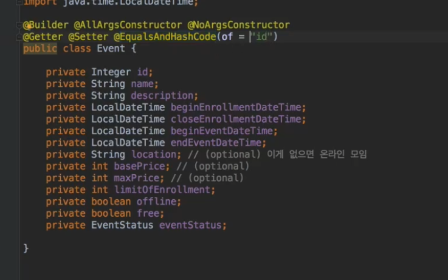
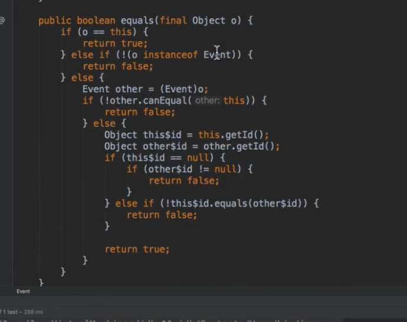
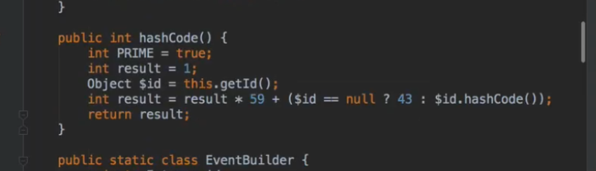

# 개요

- 소스코드 :
- 보통 equals, hashcode는 해당 클래스의 모든 필드를 가지고 구현한다. 그런데 필드중에 연관관계의 Entity가 있을때 해당 Entity가 포함되어 구현되면 순환참조가 발생할 수 있으므로, 특정 필드만 사용하여 equals, hashcode를 구현하도록 @EqualsAndHashCode(of)를 사용할 수 있다.
- 여러 필드를 넣어도 상관은 없는데, 중요한것은 연관관계의 Entity는 순환참조 문제로 인해 equals와 hashcode 구현에 포함되지 않도록 하는게 좋다

# 확인

- 롬복이 equals와 hashcode를 id만 사용하여 generate한 모습