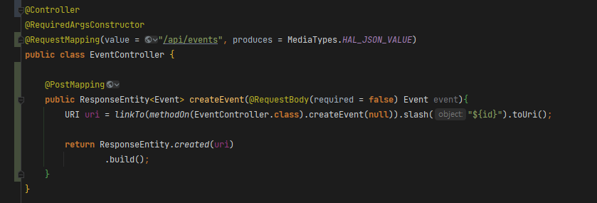
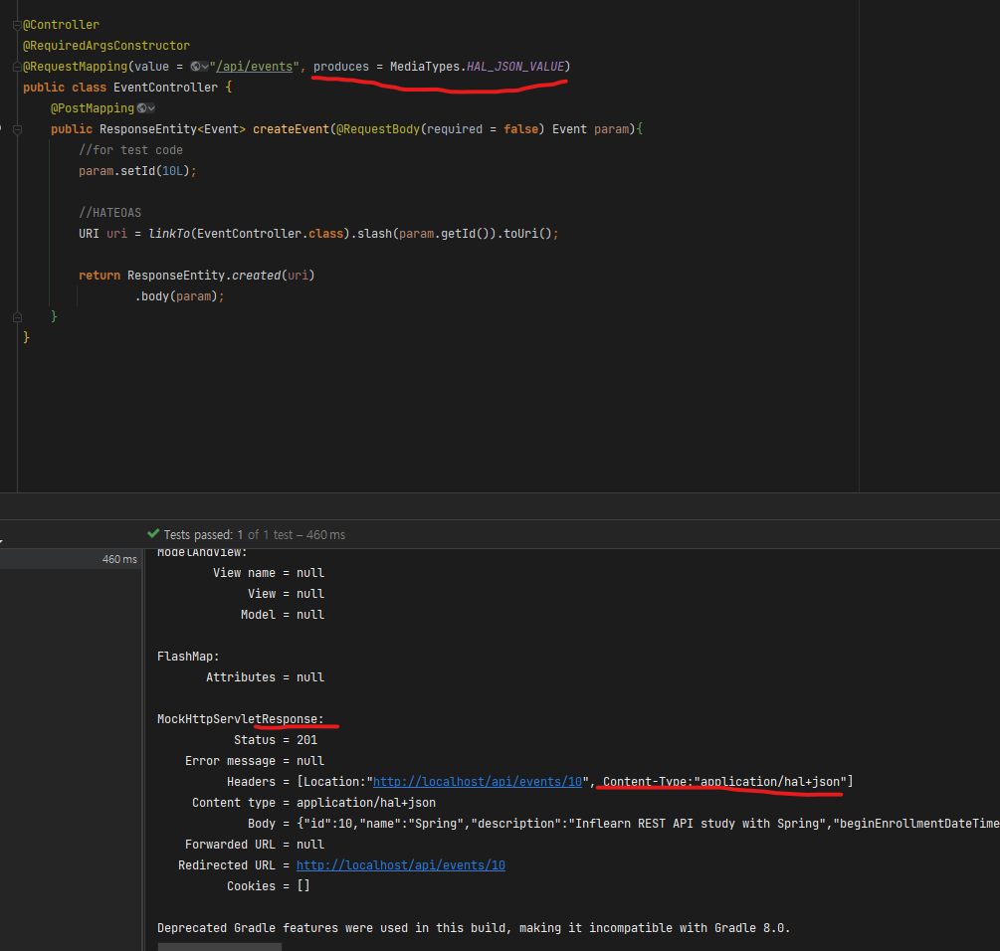

# @RequestMapping(produces = 값)

- produces 속성의 값으로 Hateoas의 MediaTypes.타입_VALUE(String)을 선택시, 해당 어노테이션의 메소드는 produces에 작성된 내용의 content type으로 응답하게 된다
- 클래스에 선언시 해당 클래스의 모든 메소드, 메소드에 선언시 해당 메소드만 해당된다

# 참고

- HAL_JSON이란?
    - [https://velog.io/@pop8682/번역-HAL-Hypertext-Application-Language](https://velog.io/@pop8682/%EB%B2%88%EC%97%AD-HAL-Hypertext-Application-Language)