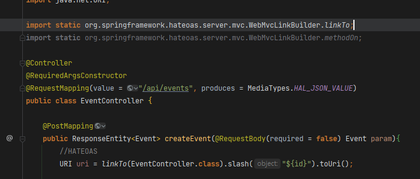
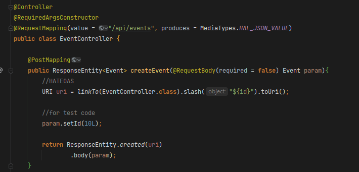
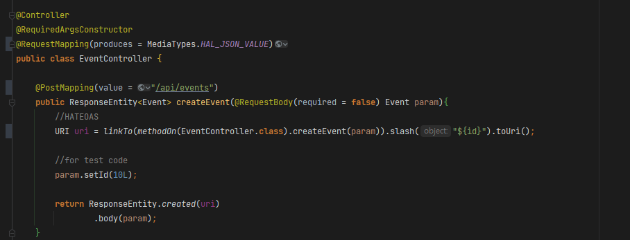
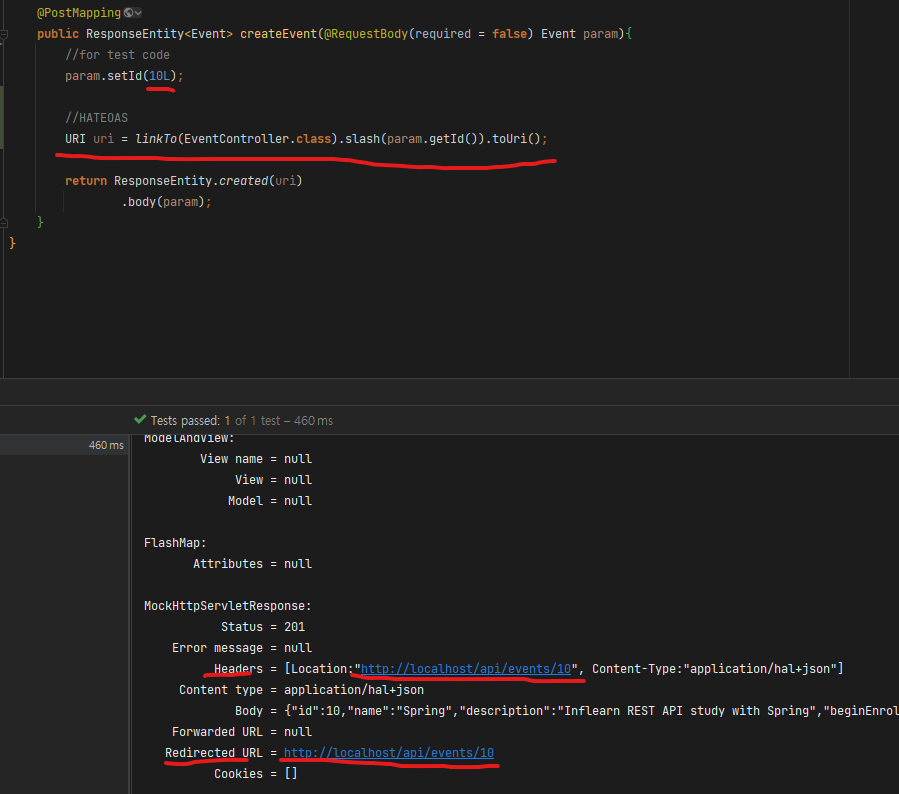

# 개요

- Spring HATEOAS 라이브러리를 통해 URI를 동적으로 Build하고, 그 URI를 link 헤더에 전달하는방식으로 REST의 HATEOAS를 충족시킬 수 있다
- Spring HATEOAS는 특히 URI를 동적으로 빌드하는것에 이용되는 라이브러리인데, 이를 이용해 어플리케이션 내 API의 링크 주소나 메소드가 변경되어도 동적으로 적용되도록 할 수 있다

# HATEOAS를 이용한 URI 동적 빌드

- 기본적으로 HATEOAS는 RequestMapping의 value값을 이용해 URI 주소를 확인한다
- 때문에 Spring HATEOS의 메소드를 호출하며 리플렉션을 이용해 클래스와 메소드만 지정해주면 해당 RequestMapping의 value값을 확인하여 URI를 Build하므로 해당 메소드의 value가 바뀌어도 동적으로 적용이 된다.
- 또한 구조상의 리팩토링이 발생했을시엔 컴파일 오류를 통해 사전에 확인할 수가 있게 된다.

## 기본사항

- 기본적으로 Spring HATEOAS의 `WebMvcLinkBuilder.linkTo()`라는 메소드를 사용함 (구 ControllerLinkBuilder)
- 메소드의 @RequestMapping value까지 확인해야 할땐 `WebMvcLinkBuilder.methodOn()`이라는 메소드를 사용함

## @RequestMapping value가 클래스(컨트롤러)에만 있을때

- 이때는 클래스의 @RequestMapping(value)값만 확인하면 되므로 클래스만 인자로 건내준다

## @RequestMapping value가 메소드에, 혹은 메소드에도 있을때

- 이때에는 메소드의 @RequestMapping value값도 확인해야 하므로 methodOn(클래스).해당메소드(파라미터)를 인자로 건내준다

# 결과

- response header의 Location, 그리고 Redirected URL에 HATEOAS로 생성한 링크가 들어있는 모습