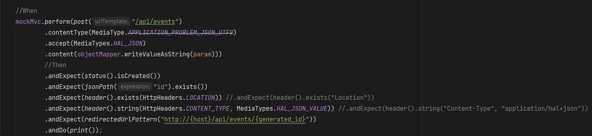

# 개요

- MockMvc를 이용한 컨트롤러 테스트 방법을 작성

# 요청

- MockMvc.perform()으로 요청 테스트를 수행할 수 있다
- perform()을 호출할때 인자로 RequestBuilder를 건내줌으로써 테스트할 요청 내용을 설정할 수 있다

## RequestBuilder

- 주요 클래스들은 MockMvcRequestBuilder, RestDocumentationRequestBuilders등이 있다.
- 이 중 RestDocumentationRequestBuilders는 Spring REST Docs 라이브러리의 객체로, `/url/{resource}`와 같은 상세조회의 URI를 동적으로 Build하여 테스트할 시 유용하게 사용된다. (MockMvcRequestBuilder가 해당부분을 동적으로 Build하는것을 지원하지 않아서)
- 주로 HttpMethod에 관련된 메소드들이 선언되어 있고, 해당 메소드를 호출하여 반환된 결과로 상세내용을 Chaining하여 정의하게 된다

### 주요 메소드

- get()
- post()
- put()
- patch()
- delete()

## MockMvcHttpServletRequestBuilder

- MockMvcRequestBuilder, RestDocumentationRequestBuilders의 메소드 호출 결과로 받게되는 클래스이다
- 주로 요청 테스트의 상세내용을 정의하게 된다

### 주요 메소드

- secure() → HTTPS 여부
- characterEncoding() → 문자열 인코딩
- contentType() → 요청 헤더 Content Type
- accept() → 요청 헤더 Accept
- header()
- headers()
- param()
- params()
- queryParam()
- queryParams() → GET방식 요청 파라미터 테스트
- content() → GET방식 외 요청 바디 테스트
- cookie() → 쿠키 테스트
- locale()
- requestAttr() → 요청 속성 테스트
- sessionAttr() → 세션 테스트

# 응답

- MockMvc.perform()은 ResultActions를 반환한다
- 이 ResultActions의 andExpect()으로 응답 테스트를 수행할 수 있다
- andExpect()를 호출할때 인자로 ResultMatcher를 건내줌으로써 테스트할 응답 내용을 설정할 수 있다

## ResultActions

- 응답 결과를 수행할 메소드가 선언된 클래스

### 주요 메소드

- andExpect()
- andDo()
- andReturn()

## MockMvcResultMatchers

- MockMvc의 응답결과 관련 객체이다
- ResultActions의 andExpect()에 인자로 건내줌으로서 테스트할 응답 결과 내용을 설정할 수 있다

### 주요 메소드

- status() → 상태코드 관련 테스트객체인 StatusResultMatchers를 리턴
- header() → 응답헤더 관련 테스트객체인 HeaderResultMatchers를 리턴
- content() → 응답바디 관련 테스트객체인 ContentResultMatchers를 리턴
- jsonPath() → 응답바디가 JSON일시 JSON 테스트 객체인 JsonPathResultMatchers를 리턴
- view() → View를 리턴할시 View 관련 테스트 객체인 ViewResultMatchers를 리턴
- model() → Model을 리턴할시 Model 관련 테스트 객체인 ModelResultMatchers를 리턴
- forwardedUrl~() → 포워드 관련 테스트를 바로 작성함
- redirectedUrl~() → 리다이렉트 관련 테스트를 바로 작성함

### StatusResultMatchers

- 상태코드 관련 테스트 객체이다
- 주요 메소드
    - isOk(), isCreated(), isContinue()....등 응답코드명으로 선언된 메소드
    - is2xxSuccessful(), is5xxServerError()...등 응답코드번호로 선언된 메소드

### HeaderResultMatchers

- 응답헤더 관련 테스트 객체이다
- 주요 메소드
    - exists()
    - string(key, value) → 테스트하고싶은 요청헤더명과 값을 인자로 넘겨줌. 주로 key, value에 HttpHeaders, MediaTypes등의 enum을 활용함

### ContentResultMatchers

- 응답내용 관련 테스트 객체이다
- 주요 메소드
    - contentType()
    - encoding()
    - xml()
    - json()

### JsonPathResultMatchers

- JSON 타입의 응답바디 관련 테스트 객체이다
- jsonPath("json key").메소드() 형태로 작성
- 주요 메소드
    - exists() → 존재여부
    - prefix()
    - value() → 값
    - isEmpty()
    - isNotEmpty()
    - isString()
    - isNumber()
    - isArray()
    - isMap()
    - isBoolean()

### ViewResultMatchers

- View 관련 테스트 객체이다
- 주요 메소드
    - name()

### ModelResultMatchers

- Model 관련 테스트 객체이다
- 주요 메소드
    - attribute()
    - attributeExists()
    - attributeDoesNotExists()
    - size()