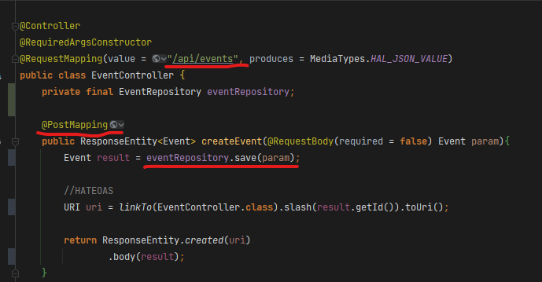
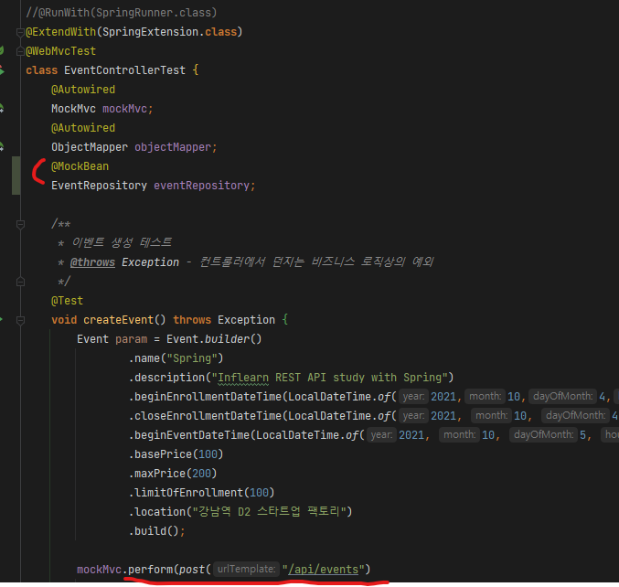
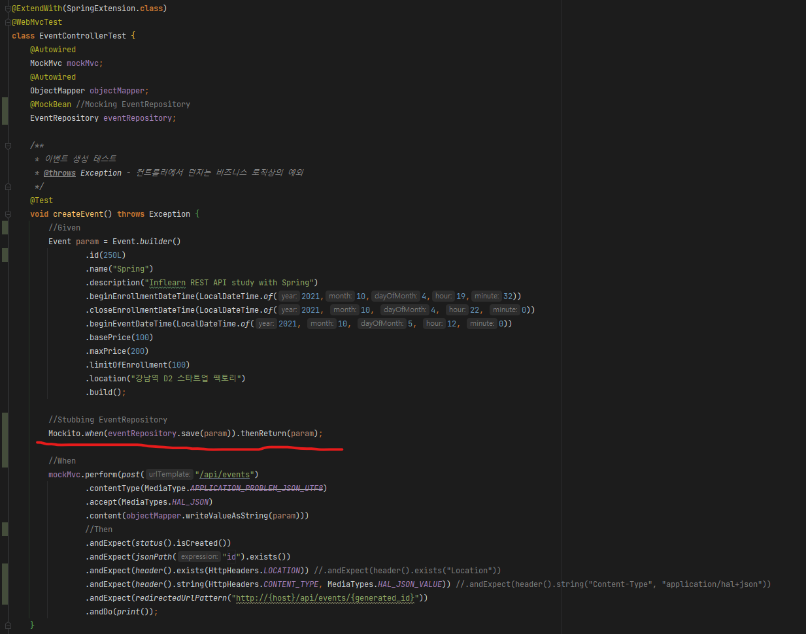

# 개요

- @WebMvcTest는 웹 MVC, 테스트 관련 클래스의 빈들만 생성해주는 Slicing 테스트이기 때문에, Service, Repository 같은 내가 별도로 작성한 클래스의 빈은 생성이 되지 않아 MVC 테스트에서 오류가 날 수 있다.
- 이럴때 @SpringBootTest로 Spring의 모든 클래스들의 빈들을 생성해줄수도 있지만
- 내가 원하는 특정 클래스의 Bean들을 직접 Mocking하여 사용할 수도 있다

> Mocking이란 어떠한것의 대역을 생성하는것을 말함.
> 
> 즉 실제 빈 대신 테스트용 빈을 대역으로 사용한다는 뜻이다.

# @MockBean으로 Mocking하기

- 내가 테스트할 메소드에서 EventRepository의 Bean을 사용하기 때문에
- 테스트코드 내 필드에 EventRepository필드를 선언 후 @MockBean을 지정해 해당 객체를 Mocking 해주었음

# Stubbing하기

- 이제 해당 객체를 접근할때는 오류가 나지 않는다
- 하지만 Mocking한 객체는 결과값이 null이기 때문에, 테스트코드에서 리턴된 결과를 확인하려고 할때 NPE가 발생한다
- 이럴때는 Stubbing을 해주어야 한다
    - Stubbing → 특정 상황에 어떠한 방식으로 동작할것을 직접 지정해주는것

# Mockito.when().then()으로 Stubbing

- Mockito의 when().thenReturn()을 이용해, 해당 MockBean의 특정 메소드 이후 일어날 행동을 직접 Stubbing 해주었다