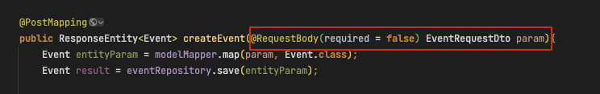
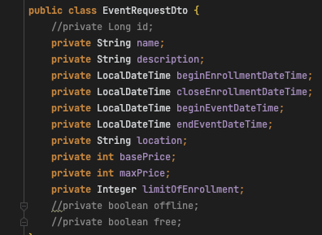
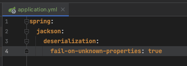
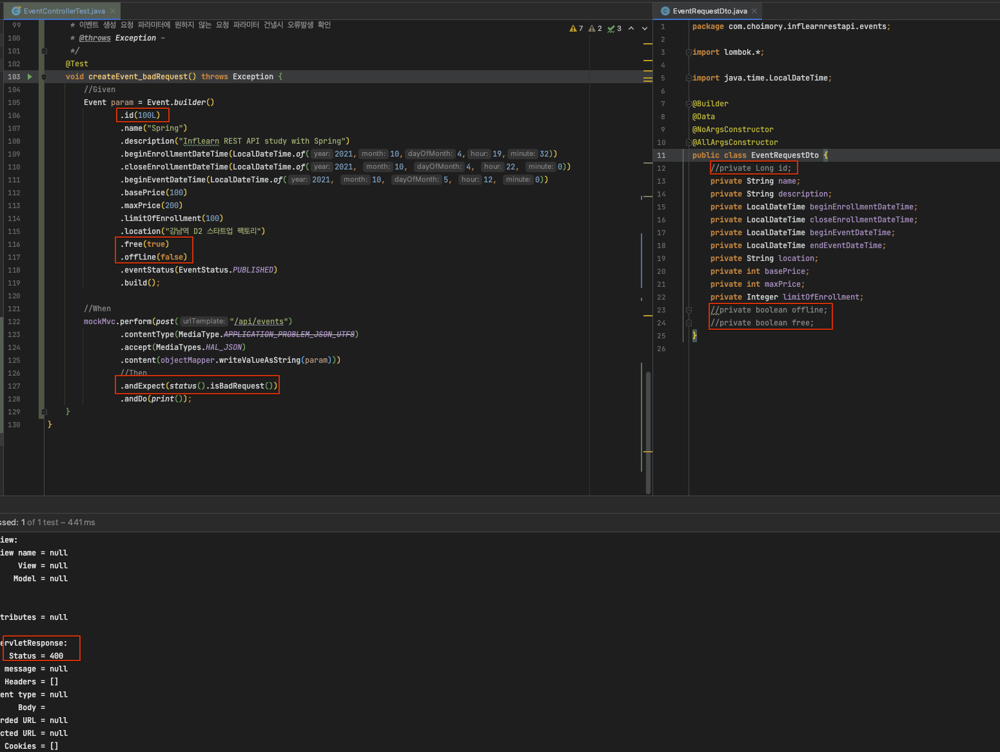

# 개요

- 컨트롤러의 매개변수에 없는 값들이 요청 파라미터로 전해졌을때 기본적으로는 해당 파라미터를 무시하게 되어있으나, 원한다면 400 응답(Bad Request)을 던지도록 할 수 있다

# 방법

- 컨트롤러

- DTO

- Yaml에서 Jackson 역직렬화 설정 중, 알지 못하는 속성에 대한 fail처리를 true로 변경

- 컨트롤러 파라미터인 DTO에 없는값을 포함하여 요청을 보냈을시 400응답 받으며 테스트 통과하는것 확인

# 참고사항

- 해당 방법은 어플리케이션 전체에 일괄 적용되는 방법이다
- Jackson 설정이므로 Request Body를 통한 JSON 요청을 객체로 역직렬화 할시에만 해당하는 방법이다
- 이 방법은 너무 타이트해서 문제가 많을것 같다.. 조금은 느슨하게 가는게 좋지 않을까