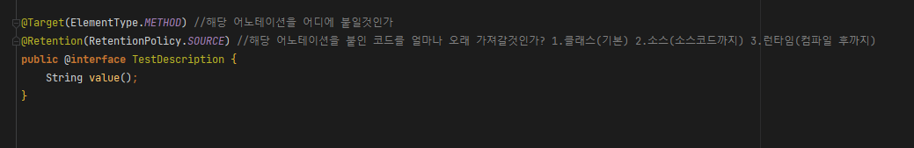
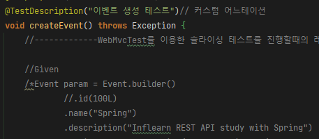

# @interface

- 어노테이션 인터페이스 선언

# @Target

- 해당 어노테이션을 어디에 붙이는 어노테이션으로 사용할것인지를 정의
    - 메소드, 클래스, 생성자, 타입, 파라미터 등등 많음

# @Retention

- 해당 어노테이션을 붙인 코드를 얼마나 오래 가져갈것인지를 정의
    1. CLASS (기본값)
    2. SOURCE (소스코드까지)
    3. RUNTIME (컴파일 후까지)

# Fields

- 해당 필드 선언시 어노테이션의 속성 값으로 필드를 초기화 가능