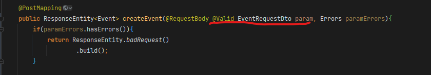
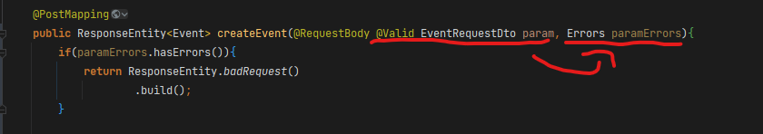
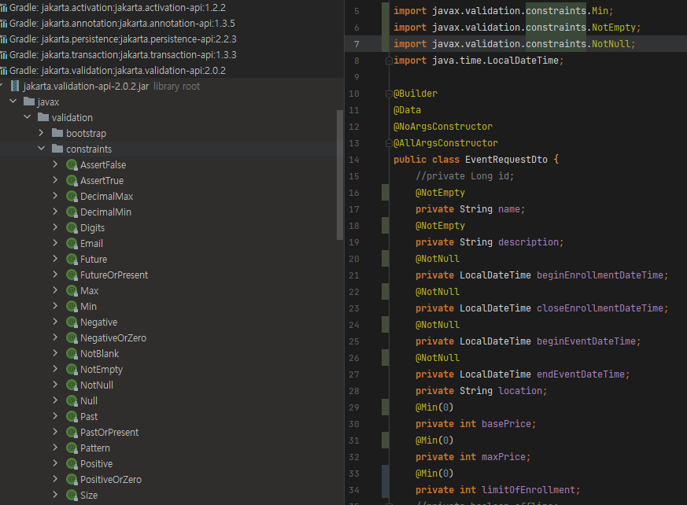
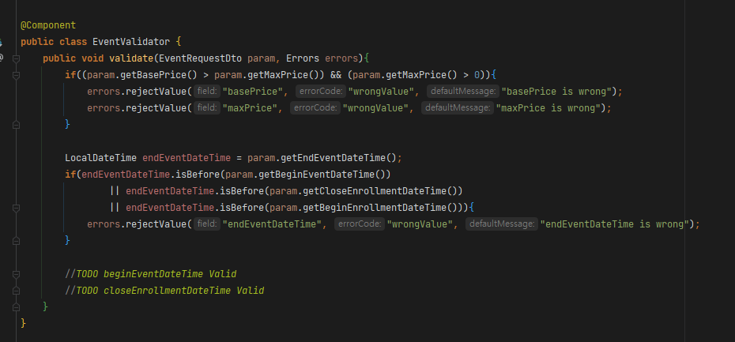
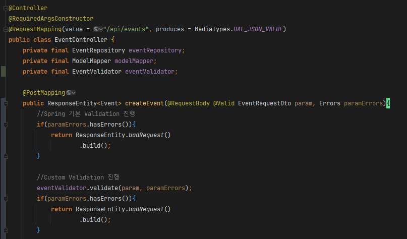

# 의존성 추가

```bash
// Gradle
implementation 'org.springframework.boot:spring-boot-starter-validation'

// Maven
<dependency>
  <groupId>org.springframework.boot</groupId>
  <artifactId>spring-boot-starter-validation</artifactId>
</dependency>
```

- 기본적으로 포함된 라이브러리가 아니므로 의존성 추가해준다

# @Valid



- javax.validation.Valid
- Spring MVC에 해당하는 부분으로 컨트롤러의 매개변수에 해당 어노테이션을 붙이면 디스패처 서블릿이 컨트롤러 매개변수에 바인딩할때 검증처리를 진행해준다

# Errors



- @Valid가 붙은 파라미터 바로 오른쪽에 Errors라는 매개변수를 선언해주면, 왼쪽의 @Valid 매개변수가 검증 실패시 오른쪽의 Errors 매개변수에 오류 내용이 바인딩된다.
  - 주의할점은 매개변수의 선언순서인데, Errors 매개변수를 @Valid 매개변수 바로 다음에 이어서 선언해야한다는 점을 유의해야한다

# Validation 기본 제공 어노테이션



- @NotEmpty, @NotNull, @Min(value), @Max(value) 등 javax.validation.constraints 하위 어노테이션들을 사용하여 옵션을 지정해줌
- 해당 어노테이션을 이용해 검증을 진행해준다

# 컨트롤러 외 @Valid 진행 클래스는 @Validated를 붙여준다

```java
@Validated //여기에 추가
@Service
public class ContactService {
		//'@Valid'가 설정된 메서드가 호출될 때 유효성 검사를 진행한다.
    public void createContact(@Valid CreateContact createContact) { 
        //Do Something
    }
}
```

- 기본적으로 @Valid가 진행되는 클래스에는 @Validated 어노테이션을 붙여주어야함
- 단 컨트롤러는 @Validated없이 @Valid만 붙여도 바로 사용이 가능하다
  - 디스패처 서블릿이 바인딩을 진행하기 때문이다

# @Validated, 제약조건 그룹핑

> 제약조건 어노테이션이 붙은 RequestDto를 요청마다 다르게 검증하고 싶다면? groups 속성과 @Validated을 이용하여 특정 제약만 검증을 진행하게 할 수 있다
>

## @Validated를 사용한 특정 제약조건만 검증하기

```java
public interface Ad {
}
```

```java
public class Message {
    @Length(max = 128)
    @NotEmpty
    private String title;
    @Length(max = 1024)
    @NotEmpty
    private String body;
    @Length(max = 32, groups = Ad.class)
    @NotEmpty(groups = Ad.class)  // 그룹을 지정할 수 있다. (기본 값은 javax.validation.groups.Default)
    private String contact;
    @Length(max = 64, groups = Ad.class)
    @NotEmpty(groups = Ad.class)
    private String removeGuide;
}
```

- 그루핑할 인터페이스를 생성한뒤, (groups = 그룹.class) 속성을 부여하고

```java
@Validated
@Service
public class MessageService {
    @Validated(Ad.class) // 메서드 호출 시 Ad 그룹이 지정된 제약만 검사한다.
    public void sendAdMessage(@Valid Message message) {
        // Do Something
    }

    public void sendNormalMessage(@Valid Message message) {
        // Do Something
    }

    /**
     * 주의: 이렇게 호출하면 Spring AOP Proxy 구조상 @Valid를 설정한 메서드가 호출되어도 유효성 검사가 동작하지 않는다. 
     * Spring의 AOP Proxy 구조에 대한 설명은 다음 링크를 참고하자.
     * - https://docs.spring.io/spring/docs/5.2.3.RELEASE/spring-framework-reference/core.html#aop-understanding-aop-proxies
     */
    public void sendMessage(Message message, boolean isAd) {
        if (isAd) { 
            sendAdMessage(message);
        } else {
            sendNormalMessage(message);
        }
    }
```

- 메소드에 @Validated(그룹클래스.class)를 작성하면 해당 제약그룹만 검증을 진행할수 있다
- 참고
  - @Valid가 진행되는 메소드를 다른 메소드에서 호출할시 AOP 구조상 검증이 진행되지 않는다

# 커스텀 Validator 작성

> 기본제공 어노테이션으로 검증을 진행하기 힘든 복잡한 검증은 커스텀 Validator을 작성하여 진행할 수 있다
>

## Custom Validator 1



- 비즈니스 로직만 직접 작성하는 아주 간단한 형식의 Custom Validator
- 단순히 param 값을 받아 원하는 검증 직접 작성 후 Errors에 값을 채우는 로직이다



- Spring Validation이 Errors를 채우지 않았을경우, 커스텀 Validator로 2차 검증을 수행하고 Errors를 한번 더 체크한다
- 해당 클래스는 단순히 검증 로직을 별도의 클래스로 분할하여, Spring Validation의 Errors 객체를 활용해 응답하는것
- 커스텀 Validator의 빈 생성 여부, 요청별 메소드 분할여부, static 메소드 선언여부 등은 본인이 생각하여 더 좋은 방식으로 작성할 수 있을것이다

## Custom Validator 2

```java
@Target({METHOD, FIELD, TYPE, CONSTRUCTOR, PARAMETER, TYPE_USE})
@Retention(RUNTIME)
@Constraint(validatedBy = SmsBytesSizeValidator.class) //커스텀 Validator 클래스 지정
@Documented
public @interface SmsBytesSize {
    String message() default "";
    Class<?>[] groups() default {};
    Class<? extends Payload>[] payload() default {};
}
```

- 커스텀 어노테이션 작성

```java
//implements ConstraintValidator<어노테이션, 검증값의 타입>
public class SmsBytesSizeValidator implements ConstraintValidator<SmsBytesSize, String> {

		//커스텀 어노테이션의 Constraint 어노테이션에서 Value를 받기로 했다면 initialize안에서 초기화해주어야 함
    @Override
    public void initialize(SmsBytesSize constraintAnnotation) {

    }

    @Override
    public boolean isValid(String value, ConstraintValidatorContext context) {
        int count = 0;
        try {
            count = value.getBytes("EUC-KR").length;
            addConstraintViolation(
                    context, "90bytes 초과"
            );
            return count < 90 ? true : false;
        } catch (UnsupportedEncodingException e) {
            e.printStackTrace();
        }
        return true;
    }

    private void addConstraintViolation(ConstraintValidatorContext context, String msg) {
        context.disableDefaultConstraintViolation();
        context.buildConstraintViolationWithTemplate(msg).addConstraintViolation();
    }
}
```

- ConstraintValidator<어노테이션, 검증할 값의 타입> 구현 클래스 작성
- isValid() 오버라이드하여 검증 로직 작성
- initialize()는 커스텀 어노테이션의 @Constraint 어노테이션에 value가 들어갈시 해당 값을 initialize()에서 받아서 초기화 해주어야함

```java
public class CreateContact {
    @SmsBytesSize 
    @Length(max = 64)
    @NotBlank
    private String uid;
    @NotNull
    private ContactType contactType;
    @Length(max = 1_600)
    private String contact;
}
```

- 해당 어노테이션 사용

# 참고

- [https://meetup.toast.com/posts/223](https://meetup.toast.com/posts/223)
- [https://gaemi606.tistory.com/entry/Spring-Boot-ResponseBody-각-항목에-크기-필수-값-설정-spring-boot-starter-validation](https://gaemi606.tistory.com/entry/Spring-Boot-ResponseBody-%EA%B0%81-%ED%95%AD%EB%AA%A9%EC%97%90-%ED%81%AC%EA%B8%B0-%ED%95%84%EC%88%98-%EA%B0%92-%EC%84%A4%EC%A0%95-spring-boot-starter-validation)
- [https://gaemi606.tistory.com/entry/Spring-Boot-유효성-검사-직접-만들기-Custom-Constraint](https://gaemi606.tistory.com/entry/Spring-Boot-%EC%9C%A0%ED%9A%A8%EC%84%B1-%EA%B2%80%EC%82%AC-%EC%A7%81%EC%A0%91-%EB%A7%8C%EB%93%A4%EA%B8%B0-Custom-Constraint)