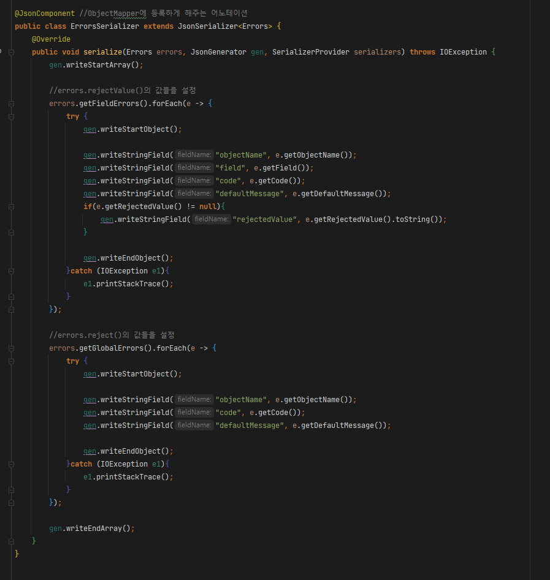

# 개요

- Java Bean 스펙을 따른 객체는 Jackson이 자동으로 직렬화를 해주지만, 그렇지 않은 객체는 JSON 직렬화에 실패하게 된다
- 이때 해당 객체를 JSON으로 직렬화하기 위해 JSON Serailizer를 구현한 Custom JSON Serializer를 작성하여 직렬화 할 수 있다

# JsonSerializer<T> 상속

- 구현하고 싶은 객체 타입의 JsonSerializer를 상속받는 클래스를 작성

# serialize() 오버라이드

- serialize()를 오버라이드 한다
- 첫번째 파라미터에 담긴 값을 두번째 파라미터 JsonGenerator에 추가한다
    - 추가방법
        1. writeStart...() 로 작성 시작
        2. write...() 로 작성
        3. writeEnd...() 로 작성 종료

# @JsonComponent

- 기본제공 어노테이션으로 해당 커스텀 JsonSerializer에 해당 어노테이션을 붙여주는것만으로 추가 적용이 완료됨