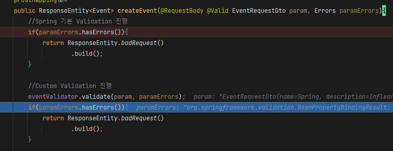
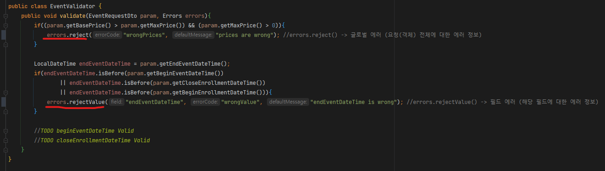
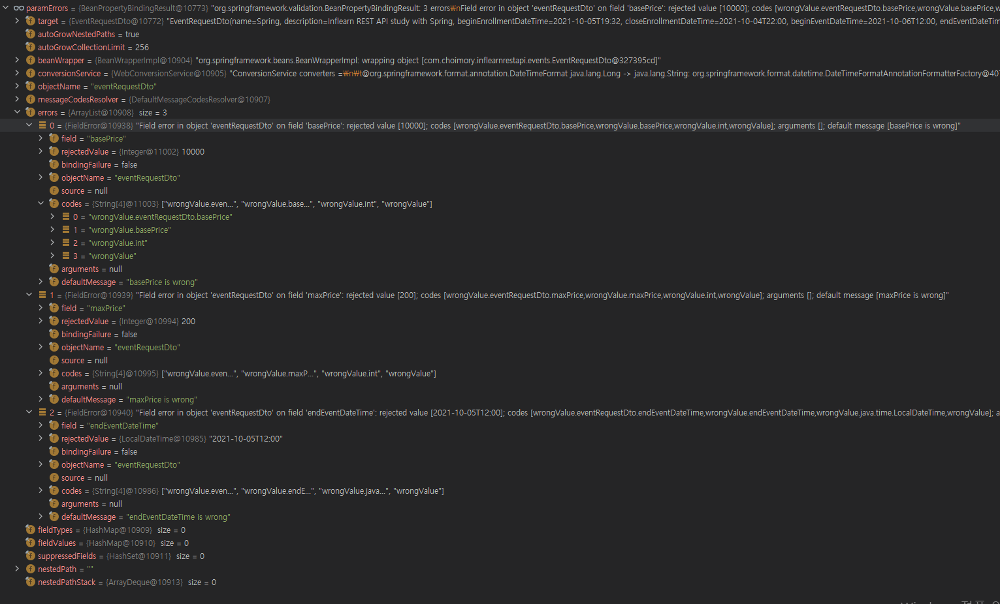

# 개요

- Errors는 Spring Validation 검증 결과가 담긴 객체이다
- 필요에 따라 내가 원하는 대로 응답하기 위해 Errors 객체를 직접 활용할 수 도 있다

# Errors.hasErrors()

- 에러 여부 확인 메소드

# 글로벌 에러와 필드 에러

- 글로벌 에러는 해당 객체 전체를 대상으로 한 에러 내용을 설명
- 필드 에러는 해당 객체 내 특정 필드를 대상으로 한 에러 내용을 설명

# 에러 작성

## Errors.reject()

- 글로벌 에러를 작성할때 사용
- `reject(String 에러 코드, String 에러 메시지)`

## Errors.rejectValue()

- 필드 에러를 작성할때 사용
- `rejectValue(String 필드명, String 에러코드, String 에러메시지)`

# 에러 반환

## GetFieldErrors

### FieldError 클래스

- 필드 에러 값이 담긴 객체
- 주요 필드
    - `objectName` - 객체명
    - `field` - 필드명
    - `code` - 오류 코드
    - `defaultMessage` - 오류 메시지
    - `rejectValue` (Optional) - 오류를 일으킨 검증 값

## GetGlobalErrors

### ObjectError 클래스

- 글로벌 에러 값이 담긴 객체
- 주요 필드
    - `objectName` - 객체명
    - `code` - 오류 코드
    - `defaultMessage` - 오류 메시지