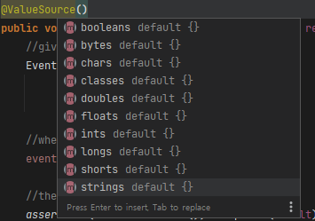
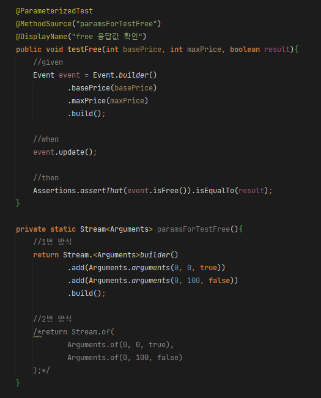
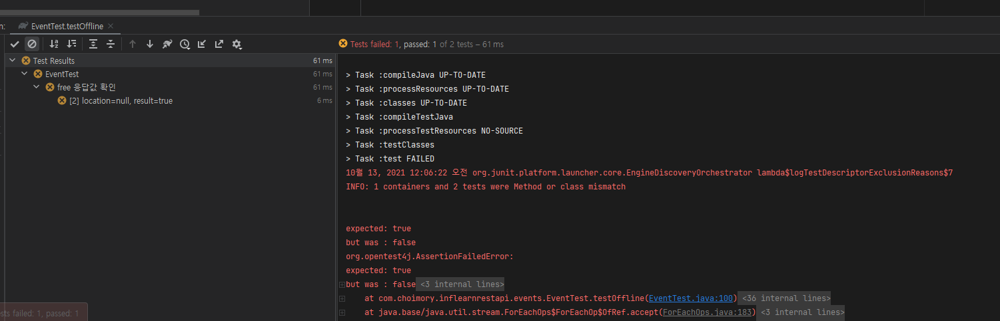

# JUnit 4

```java
<dependency>
  <groupId>pl.pragmatists</groupId>
  <artifactId>JUnitParams</artifactId>
  <version>1.1.1</version>
  <scope>test</scope>
</dependency>
```

- JUnit Params 라이브러리 추가

```java
@RunWith(JUnitParamsRunner.class)
```

- RunWith에 `JUnitParamsRunner.class`추가

```java
@Test
@Parameters({"0, 0, true", 
"100, 0, false", 
"0, 100, false"})
public void 메소드명(int a, int b, boolean c){
	Event event = Event.builder()
		.fieldA(a)
		.fieldB(b)
		.build();
	
	assterThat(event.fieldC()).isEqualTo(c);
}
```

```java
//parameters

@Test
@Parameters(method = "parametersFor메소드명")
public void 메소드명(int a, int b, boolean c){
	Event event = Event.builder()
		.fieldA(a)
		.fieldB(b)
		.build();
	
	assterThat(event.fieldC()).isEqualTo(c);
}

private Object[] parametersFor메소드명(){
	return new Object[]{
		new Object[]{0, 0, true},
		new Object[]{100, 0, false},
		new Object[]{0, 100, false},
		new Object[]{100, 200, false}
	}
}
```

- 파라미터가 세개이므로 세번 테스트함
- 테스트 실패한 내용이 있으면 해당 내용만 따로 표시됨
- 2번 예시의 경우 `parametersFor`가 약속된 prefix이므로 해당 prefix를 지켰을시 `@Parameters`의 method 속성을 생략 가능함

# JUnit 5

- JUnit 5 (Jupiter)의 경우, 기본적으로 junit.jupiter.params가 기본 제공된다
- `@Test` 대신 `@ParameterizedTest` 어노테이션 및 매개변수 관련 어노테이션을 붙여 바로 사용이 가능하다

## 단일 파라미터



```java
@ParameterizedTest
@ValueSource(ints = {1,2,3}
public void test(int param){
	//do something
}

@ParameterizedTest
@ValueSource(strings = {"1","2","3"}
public void test(String param){
	//do something
}
```

- Enum을 제외한 경우는 모두 `@ValueSource(type = {value..})`로 작성한다

```java
@ParameterizedTest
@EnumSource(ChronoUnit.class)
void testWithEnumSource(TemporalUnit unit) {
    assertNotNull(unit);
}

@ParameterizedTest
@EnumSource(names = { "DAYS", "HOURS" })
void testWithEnumSourceInclude(ChronoUnit unit) {
    assertTrue(EnumSet.of(ChronoUnit.DAYS, ChronoUnit.HOURS).contains(unit));
}

```

- Enum의 경우 `@EnumSource`를 사용한다

## 복수 파라미터



```java
@ParameterizedTest
@MethodSource("stringIntAndListProvider")
void testWithMultiArgMethodSource(String str, int num, List<String> list) {
    assertEquals(5, str.length());
    assertTrue(num >=1 && num <=2);
    assertEquals(2, list.size());
}

static Stream<Arguments> stringIntAndListProvider() {
    return Stream.of(
        arguments("apple", 1, Arrays.asList("a", "b")),
        arguments("lemon", 2, Arrays.asList("x", "y"))
    );
}
```

- `Stream<Arguments>`를 리턴하는 메소드를 작성한다
    - Arguments 객체는 `arguments(Object...)` 혹은 `of(Object...)`로 생성한다
    - 매개변수 순서는 테스트코드의 매개변수 순서와 일치하여야 한다
- 작성한 메소드명을 지정하는 `@MethodSource("메소드명")`을 테스트코드 메소드에 작성한다

## @MethodSource를 이용한 단일 파라미터 적용

```java
@ParameterizedTest
@MethodSource("paramsForTest")
public void test(String param){
	//do something
}

private Stream<String> paramsForTest(){
	return Stream.<String>builder()
	          .add("a")
	          .add("b")
	          .add("c")
	          .build();
}
```

```java
@ParameterizedTest
@MethodSource("range")
void testWithRangeMethodSource(int argument) {
    Assertions.assertThat(argument).isNotEqualTo(9);
}

static IntStream range() {
    return IntStream.range(0, 20).skip(10);
}
```

- @MethodSource를 지정한 메소드가 단일타입 Stream이라면 단일 파라미터에도 적용이 가능하다

# 부분 실패시



- 테스트 실패 메소드만 목록에 표시된다

# 참고

- [https://junit.org/junit5/docs/current/user-guide/#writing-tests-parameterized-tests](https://junit.org/junit5/docs/current/user-guide/#writing-tests-parameterized-tests)
- [https://lannstark.tistory.com/52](https://lannstark.tistory.com/52)