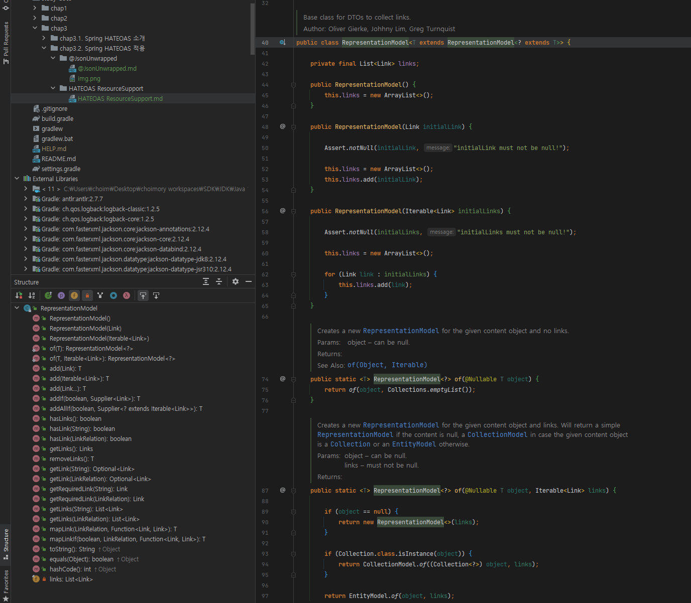
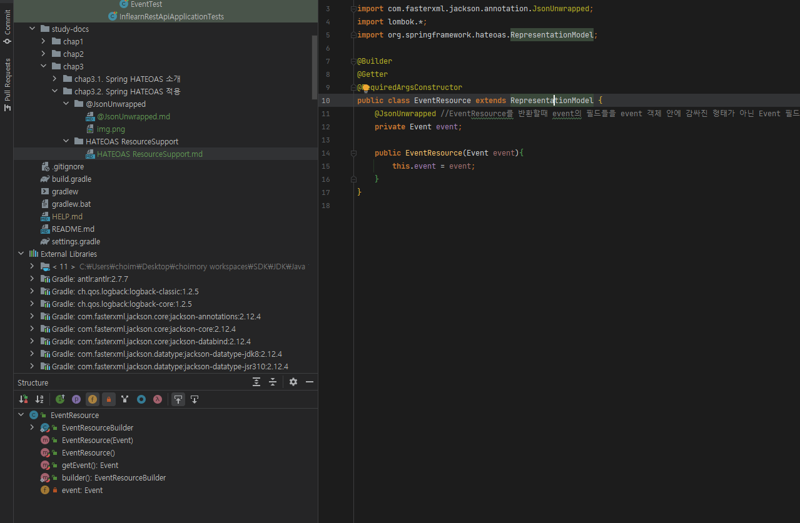
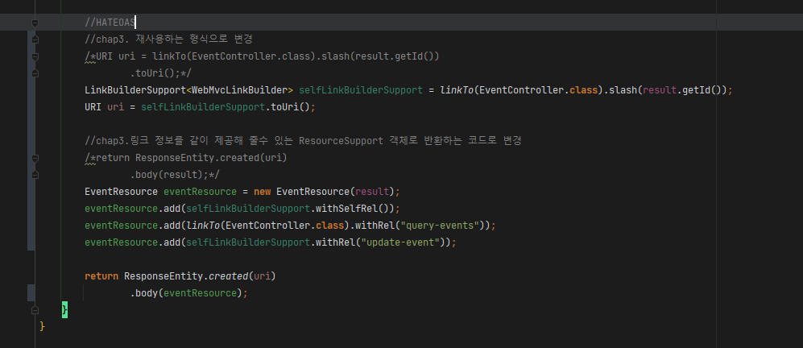

- HATEOAS에서 링크 정보를 넣어주는 방법
- DTO등의 응답 객체에 ResoureceSupport를 상속시킨다
  - 해당 ResourceSupport에는 HATEOAS로 만드는 링크를 add 해줄수 있는 필드와 메소드들이 존재하며 이를 상속하여 추가하게 함
  - ResourceSupport는 최신버전의 HATEOAS에서 RepresentationModel로 변경되었음